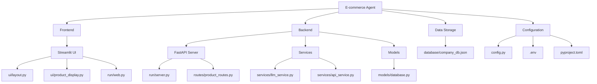

# E-commerce Agent Project Structure

## Component Descriptions

1. **Frontend (Streamlit)**
   - User interface for product management
   - Product display and categorization

2. **Backend (FastAPI)**
   - RESTful API endpoints
   - Business logic processing
   - Integration with LLM services

3. **Services**
   - LLM Service: AI-powered product classification
   - API Service: External API communication

4. **Data Models**
   - Database models for product information

5. **Data Storage**
   - JSON-based product database

6. **Configuration**
   - Environment variables
   - Project dependencies 